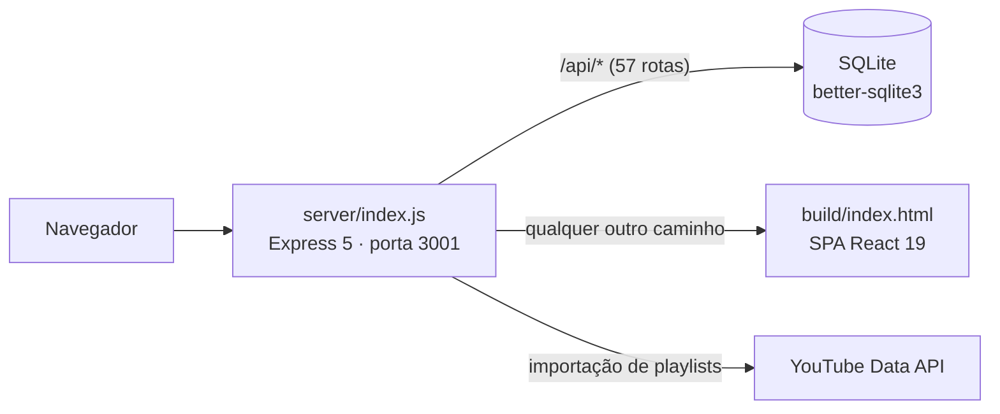

# Arquitetura da plataforma RECPSP

> Mapa do sistema como ele **é hoje**, para quem vai programar nele — inclusive
> sessões paralelas do Claude Code. O `CLAUDE.md` diz onde não tropeçar; este
> arquivo diz como a coisa está montada. O que a plataforma **deve** fazer está no
> Documento de Requisitos da Plataforma, em `docs/requisitos/`.

| | |
|---|---|
| Versão | 1.0 |
| Data | 26/08/2026 |
| Base | código importado de `dudyfarias/RECPSP` (31/07/2026) + containerização de 26/08 |
| Fonte | leitura integral de `server/index.js` (1.911 linhas), `package.json`, `docker-compose.yml`, `src/` |

---

## 1. O sistema em uma tela

Monólito Node. Uma única `package.json` cobre front e back, e **um único processo**
serve a API e o site em produção.



- **Front** — React 19, React Router 7, TanStack Query 5, sobre Create React App 5
  com CRACO; Tailwind 3.
- **Back** — Express 5, SQLite via `better-sqlite3` (síncrono), JWT + bcrypt,
  `helmet`, `cors`, `express-rate-limit`.
- **Sem camada de serviço, sem ORM, sem migrations.** As consultas SQL vivem
  inline nas rotas.

Em desenvolvimento sem Docker são **dois processos** (React na 3000, API na 3001);
em Docker e em produção é **um só**, que serve `build/`.

## 2. A ordem de execução importa

`server/index.js` não é um arquivo de rotas: é um **script que roda de cima para
baixo no boot**. Metade dele executa antes de a primeira rota ser registrada.

1. `require`s, leitura de variáveis de ambiente e avisos de configuração
2. Abertura do banco, `journal_mode = WAL`, **`foreign_keys = ON`**
3. Função SQL customizada `normalize_text` (busca sem acento)
4. **Schema** — `CREATE TABLE IF NOT EXISTS` de 18 tabelas
5. **`ALTER TABLE` avulsos** em `try/catch` vazios (o substituto das migrations)
6. **Seed**, guardado por "existe algum usuário com papel admin?"
7. Importação das playlists padrão do YouTube (assíncrona, dispara no boot;
   `SKIP_PLAYLIST_IMPORT=1` pula — é o que os testes usam)
8. Seed fixo de 14 cursos na tabela `resources`
9. Correções de acentuação em categorias e tags de bancos antigos
10. Middlewares → rotas → error handler → estáticos → rota curinga → `listen`
    (só quando executado diretamente; sob `require`, o arquivo exporta o `app` —
    é assim que os testes de API o carregam)

Consequência prática: **inserir código na região errada não dá erro, dá
comportamento silencioso**. Uma rota registrada depois da curinga nunca é
alcançada; um `CREATE TABLE` colocado depois do seed não é visto por ele.

## 3. Mapa de regiões do `server/index.js`

Os números de linha são de 26/08/2026 e **vão envelhecer**. Use-os para se
localizar; confirme pelo comentário de seção, que é estável:
`// =================== NOME ===================`.

| Linhas | Seção | O que faz |
|---|---|---|
| 1–39 | (topo) | `require`s, env, `normalize_text`, `capitalizeInitial` |
| 40–257 | SCHEMA | 18 `CREATE TABLE` + `ALTER TABLE` de evolução |
| 258–470 | SEED | admin, 11 categorias, 10 tags, 5 usuários e 15 tópicos de demonstração |
| 472–508 | IMPORTAR PLAYLISTS PADRÃO | 3 playlists do YouTube, só se `resources` estiver vazia |
| 510–535 | CURSOS DE CAPACITAÇÃO | seed fixo de 14 cursos (ENAP, Escola Virtual, YouTube) |
| 537–567 | CORRIGIR ACENTOS | reparo de categorias e tags em bancos antigos |
| 568–605 | MIDDLEWARES · SECURITY · RATE LIMITING | CORS, `express.json`, helmet, limitador de autenticação |
| 606–654 | HEALTH CHECK e guardas | `/api/health`, `auth`, `optionalAuth`, `adminOnly` |
| 655–707 | AUTH | registro e login |
| 708–884 | PERFIL | `me`, aceite do comunicado, perfil, interesses, progresso de curso |
| 885–911 | PERFIL PÚBLICO | `GET /api/users/:id` |
| 912–979 | MENSAGENS | envio, lista de conversas, conversa |
| 980–992 | NOTIFICAÇÕES | listar (limite fixo de 20) e marcar como lidas |
| 993–1029 | CATEGORIAS | CRUD (escrita só admin) |
| 1030–1047 | TAGS | listar e criar |
| 1048–1255 | TÓPICOS | lista paginada, lista por categoria, criação, fixar, travar, excluir |
| 1256–1288 | VOTAÇÃO | voto em enquete |
| 1289–1308 | VIEWS | contador com janela de 30 min por IP |
| 1309–1325 | LIKES | curtida em tópico |
| 1326–1466 | POSTS | **detalhe do tópico** (`GET /api/topics/:id`), respostas, edição, exclusão |
| 1467–1502 | POST LIKES | curtir e descurtir resposta |
| 1503–1518 | BEST ANSWER | marcar melhor resposta |
| 1519–1535 | RELATED TOPICS | 5 tópicos aleatórios aprovados |
| 1536–1555 | SEARCH | busca em tópicos e recursos |
| 1556–1645 | RESOURCES | listar, relacionados, importar playlist, criar e excluir |
| 1646–1793 | ADMIN | usuários, interesses, banir, excluir, papel |
| 1794–1834 | ESPECIALISTAS | conceder e revogar especialidade |
| 1835–1893 | MODERAÇÃO DE TÓPICOS | pendentes, aprovar, rejeitar |
| 1894–1899 | ERROR HANDLER GLOBAL | devolve 500 genérico |
| 1900–1911 | SERVIR REACT BUILD | estáticos, rota curinga `{*path}`, `listen` |

**Armadilha de navegação:** as rotas de tópico estão espalhadas por **quatro**
regiões — TÓPICOS (1048), POSTS (1328, onde mora o detalhe), RELATED (1521) e
RESOURCES (1563, `related-resources`). Procurar por `'/api/topics` no arquivo
inteiro é mais confiável do que ir à seção TÓPICOS.

## 4. O caminho de uma requisição

```
CORS (lista de origens por ALLOWED_ORIGINS)
  → express.json({ limit: '5mb' })
  → helmet (CSP DESATIVADA, COEP desativado)
  → [authLimiter, só em /api/auth/register e /api/auth/login]
  → [auth | optionalAuth | adminOnly, por rota]
  → handler da rota (SQL inline, better-sqlite3 síncrono)
  → error handler global (500 genérico)
  → express.static(build/)
  → app.get('{*path}') devolve index.html
```

Notas que mudam decisões de implementação:

- **`better-sqlite3` é síncrono.** Cada consulta bloqueia o event loop. Não há
  `await` em nada de banco — e uma consulta pesada trava o processo inteiro.
- **O limitador cobre só a autenticação** (20 tentativas por IP a cada 15 min).
  O resto da API não tem limite.
- **`express.json` aceita até 5 MB** porque o editor de texto rico envia HTML no
  corpo. Acima disso, 413.
- **A rota curinga usa sintaxe do Express 5** (`'{*path}'`). O `'*'` do Express 4
  não funciona.

## 5. Autenticação e papéis

JWT no header `Authorization: Bearer <token>`, validade de 7 dias, assinado com
`JWT_SECRET`. Três guardas:

| Guarda | Comportamento |
|---|---|
| `auth` | exige token válido; recarrega o usuário do banco a cada requisição; 403 se banido |
| `optionalAuth` | popula `req.user` se houver token; segue adiante sem ele |
| `adminOnly` | exige `role === 'admin'`; usar **sempre depois** de `auth` |

O papel é relido do banco a cada requisição (`authUserByIdStmt`), não do token —
então promover, rebaixar ou banir tem efeito imediato, sem esperar o token expirar.
Bom comportamento; mantenha.

### Os papéis não são três, são quatro

`README.md` e a validação de `PUT /api/admin/users/:id/role` falam em
`user`, `moderator` e `admin`. Mas conceder especialidade grava um quarto valor:

```js
db.prepare("UPDATE users SET role = 'especialista' WHERE id = ? AND role = 'user'")
```

`especialista` **não está no enum aceito pela rota de papel**, e `adminOnly` e as
checagens de moderação só reconhecem `admin` e `moderator` — então o especialista
tem, na prática, os poderes de um usuário comum, mais o destaque visual. O front
(`Topic.js`, `Admin.js`, `UserProfile.js`) já trata esse valor. Não é bug de
runtime, é inconsistência de modelo: ao mexer em papéis, considere os quatro
valores possíveis.

## 6. Visibilidade e moderação — a máquina de estados

`topics.status` assume `approved`, `pending` ou `rejected`, e `topics.locked`
é um booleano independente. A regra de quem enxerga o quê está **repetida em
quatro lugares** (`GET /api/topics`, `GET /api/categories/:id/topics`,
`GET /api/topics/:id`, `POST /api/posts`) — alterar em um só deixa o sistema
incoerente.

| Quem | Enxerga |
|---|---|
| Visitante | só `approved` **e** `locked = 0` |
| Usuário autenticado | `approved` + os próprios `pending` |
| Moderador e admin | tudo, menos `rejected` nas listagens |

**O que dispara a moderação prévia hoje:**

```js
const hasMedia = (image_url && image_url.trim()) || (video_url && video_url.trim());
const isAdminOrMod = req.user.role === 'admin' || req.user.role === 'moderator';
const topicStatus = (hasMedia && !isAdminOrMod) ? 'pending' : 'approved';
```

Ou seja: **só tópicos com imagem ou vídeo entram pendentes.** Um tópico de texto
puro de usuário comum é publicado direto. A decisão registrada na apresentação de
26/08 (Laís) é que **todo** tópico novo passe por curadoria prévia — o código
ainda não faz isso. Ver `QUESTIONS.md`, pergunta 11.

## 7. Exclusão em cascata é manual

As chaves estrangeiras foram declaradas **sem `ON DELETE`** (a única exceção é
`user_course_progress`, com `ON DELETE CASCADE`). Como o boot liga
`foreign_keys = ON`, apagar uma linha-pai com filhos **falha** com erro de
restrição. Por isso cada exclusão limpa as dependências à mão, dentro de
transação: `DELETE /api/admin/users/:id` (nove tabelas), `DELETE /api/topics/:id`
e `DELETE /api/posts/:id`.

As duas últimas tinham um defeito, **confirmado em execução e corrigido em
26/08/2026** (a inferência de leitura registrada na v1.0 deste documento estava
correta):

- Reprodução, com teste escrito antes da correção: criar tópico → responder →
  curtir a resposta → excluir o tópico devolvia **500**
  (`FOREIGN KEY constraint failed`) e deixava o tópico **parcialmente
  destruído** — tags e curtidas do tópico já apagadas; tópico, respostas e
  curtidas de resposta de pé. Excluir uma resposta curtida falhava igual.
- Correção conservadora: as duas rotas passaram a limpar `post_likes` e
  `post_dislikes` e a rodar **em transação**, no padrão de
  `DELETE /api/admin/users/:id`. Regressão coberta por
  `server/test/exclusao.test.js`.
- A saída estrutural — migrar as FKs para `ON DELETE CASCADE`, que elimina a
  classe inteira de erro — mexe no schema e ficou como recomendação para o
  ADR 0001 (decisão de banco; `docs/QUESTIONS.md`, pergunta 4).

`DELETE /api/categories/:id` continua sem limpeza nenhuma (tópicos e
`user_categories` presos ou órfãos) — ver `MODELO_DE_DADOS.md`, seção 5.

**Regra para quem for mexer aqui:** toda tabela nova que referencie `users`,
`topics` ou `posts` precisa entrar nas três rotinas de exclusão — ou, melhor,
o conjunto deve migrar para `ON DELETE CASCADE` no schema, o que elimina a
classe inteira de erro. Ver `MODELO_DE_DADOS.md`, seção "Protocolo de alteração".

## 8. Front: páginas, rotas e endpoints

O cliente HTTP é único (`src/api.js`) e lê `REACT_APP_API_URL`, com padrão `/api`.
Sessão e token vivem em `src/context/AuthContext.js`.

| Página (`src/pages/`) | Consome |
|---|---|
| `Home.js`, `Portal.js` | `/api/topics`, `/api/categories` |
| `Categories.js`, `Category.js` | `/api/categories`, `/api/categories/:id/topics` |
| `Topic.js` | `/api/topics/:id`, `/api/posts`, likes, votação, `related`, `related-resources` |
| `NewTopic.js` | `/api/topics`, `/api/tags`, `/api/categories` |
| `Capacitacao.js` | `/api/resources`, `/api/auth/course-progress`, `src/data/capacitacaoCourses.js` |
| `CalendarioEventos.js` | `src/data/capacitacaoEvents.js` (dado estático no front) |
| `MinhaJornada.js` | `/api/auth/course-progress` — **desligada** por `MINHA_JORNADA_ENABLED = false` |
| `Messages.js` | `/api/messages`, `/api/messages/:userId` |
| `UserProfile.js` | `/api/users/:id` |
| `Admin.js` | todo o grupo `/api/admin/*` |
| `Login.js`, `Register.js`, `Terms.js` | `/api/auth/*` |

**Conteúdo de capacitação mora em três lugares diferentes** — `src/data/
capacitacaoCourses.js` e `capacitacaoEvents.js` no front, o seed de 14 cursos em
`resources` no servidor, e a lista fixa `CAPACITACAO_COURSE_IDS` (10 identificadores)
que valida o progresso. Os três não coincidem. Ver `QUESTIONS.md`, pergunta 12.

## 9. Onde encaixar código novo

| Você quer | Faça | Cuidado |
|---|---|---|
| Nova rota da API | registre **antes** da seção SERVIR REACT BUILD (linha ~1900) | depois da curinga a rota nunca é alcançada |
| Nova tabela | acrescente ao bloco SCHEMA (linhas 40–257) | o seed roda depois; `IF NOT EXISTS` não altera tabela que já existe |
| Nova coluna | novo `ALTER TABLE` em `try/catch`, junto dos demais (linhas ~193–225) | é o único mecanismo de evolução disponível |
| Novo papel ou permissão | `adminOnly` + o enum de `PUT /api/admin/users/:id/role` + as checagens de moderação | há quatro valores de papel em circulação (seção 5) |
| Nova página React | `src/pages/` + rota em `src/App.js` | a curinga do servidor já cobre o roteamento |
| Recurso a desligar sem remover | flag em `src/config/features.js` | padrão já usado por `MINHA_JORNADA_ENABLED` |

## 10. Sessões paralelas: como não colidir

O back inteiro é **um arquivo de 1.911 linhas**. Duas sessões trabalhando em
funcionalidades diferentes editam o mesmo arquivo e conflitam em todo merge —
documentação nenhuma resolve isso. Regras de convivência, em ordem de preferência:

1. **Fila única no back.** Só uma sessão por vez mexe em `server/index.js`. As
   demais trabalham no front, que é naturalmente particionado por página.
2. **Partição por página no front.** Cada sessão fica dona de um conjunto de
   arquivos em `src/pages/` e `src/components/`. Componentes compartilhados
   (`Navbar`, `Footer`, `Breadcrumbs`) entram na fila única.
3. **Worktrees do git** para trabalho simultâneo de verdade — lembrando que cada
   worktree precisa do próprio `.env`, e que o banco de dev
   (`server/forum.db`) **não** é compartilhado entre eles.
4. **Modularizar antes de escalar.** A saída estrutural é quebrar
   `server/index.js` em roteadores por domínio (`routes/auth.js`, `routes/topics.js`,
   `routes/admin.js`…) e mover o schema para migrations versionadas. Enquanto isso
   não acontece, o paralelismo no back é limitado por construção.

Antes de abrir qualquer sessão paralela, garanta que ela leia, nesta ordem:
`CLAUDE.md` (limites e armadilhas) → este arquivo (como funciona) →
`MODELO_DE_DADOS.md` (o que existe no banco) → `QUESTIONS.md` (o que ainda não
foi decidido — não invente resposta) → Documento de Requisitos (o que construir).

## 11. Dívidas estruturais que afetam quem programa

Estas não são "melhorias futuras": elas mudam como o código deve ser escrito hoje.

| Dívida | Efeito no dia a dia |
|---|---|
| Sem migrations | qualquer mudança de coluna existente exige script manual; `IF NOT EXISTS` não atualiza tabela criada |
| Sem índices | nenhum `CREATE INDEX` no schema; as consultas de listagem fazem varredura com subconsultas correlacionadas |
| Sem paginação fora de `/api/topics` | `/api/categories/:id/topics`, `/api/resources` e `/api/admin/users` devolvem tudo |
| `viewedTopics` é um `Map` em memória | a janela de 30 min para contagem de visualizações se perde a cada reinício e não funciona com mais de uma instância |
| SQLite mono-instância | impede rodar duas réplicas; decisão sobre Postgres pendente (ADR a escrever) |
| CSP desativada | qualquer trabalho de segurança de front esbarra nisso primeiro |
| Testes cobrem o crítico, não o todo | 5 de front + 23 de API (seção 12); mensagens, notificações, votação, busca e recursos seguem sem cobertura |

## 12. Laço de verificação

Instalado em 26/08/2026. O comando que responde "quebrou?" é:

```bash
make test        # front (react-scripts) + API (node:test)
```

- **Executor da API: `node:test`**, embutido no Node 18+. Escolha deliberada: o
  runtime da imagem Docker instala só as `dependencies` (os 7 pacotes do
  servidor), então qualquer executor externo teria de viver em `devDependencies`
  e nunca existir em produção — o `node:test` zera a dependência e o risco de
  dessincronizar o lock (que já rejeitou `npm ci` uma vez, ver `CLAUDE.md`).
  As requisições usam o `fetch` global do Node contra `app.listen(0)`.
- **Pré-requisito no servidor:** `server/index.js` exporta o `app` e só chama
  `listen` quando executado diretamente (`require.main === module`);
  `SKIP_PLAYLIST_IMPORT=1` pula a importação de playlists no boot.
- **Isolamento:** cada arquivo de teste roda em processo próprio (padrão do
  `node --test`) com `DB_PATH` apontando para um arquivo temporário — o seed
  roda limpo e nada toca `server/forum.db` nem o volume do container.
- **Orçamento de autenticação:** o limitador permite 20 tentativas por IP a
  cada 15 minutos e vale nos testes; `server/test/helpers.js` faz cache de
  token por e-mail. Arquivo de teste novo deve economizar logins.
- **Cobertura (23 testes em `server/test/`):** autenticação (aceite de termos,
  banimento, papel relido a cada requisição), visibilidade/moderação nos quatro
  pontos onde a regra está repetida (seção 6), exclusão em cascata (seção 7) e
  autorização admin × moderador × usuário.
- **CI:** `.github/workflows/ci.yml` roda `npm ci`, lint, as duas suítes e o
  build, em PR e na `main`, com Node 22 (mesma major da imagem Docker).

## 13. Manutenção deste documento

Atualize quando mudar a **estrutura**, não a cada funcionalidade: nova seção no
`server/index.js`, nova tabela, mudança de papéis ou de regra de visibilidade,
modularização do back, troca de banco. Os números de linha da seção 3 podem ficar
desatualizados sem prejuízo — os nomes das seções são a âncora estável.

Documentos irmãos: `MODELO_DE_DADOS.md`, `QUESTIONS.md`, `CLAUDE.md` (raiz),
`README.md` (raiz). ADRs da frente ficarão em `docs/adr/`, no padrão da BDLP;
os ADRs transversais do laboratório vivem na vault (`SGGD - SEGES - LILP/ADR/`).
