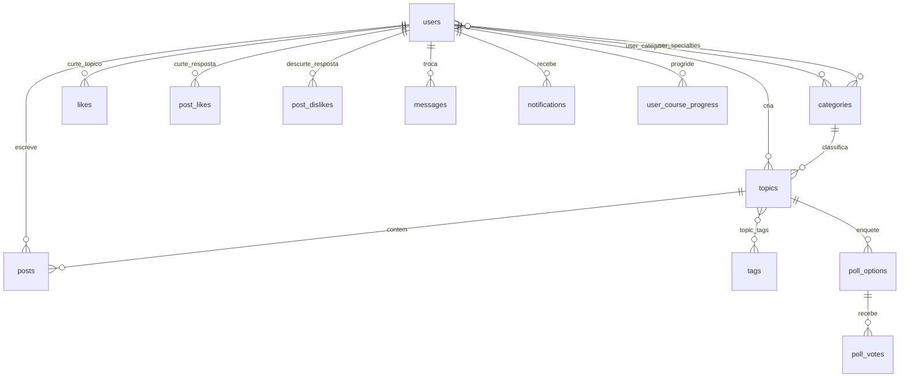

# Modelo de dados da plataforma RECPSP

> **Aviso (27/08/2026):** este documento descreve as 18 tabelas SQLite da **base
> legada**, cujo banco contém apenas demonstração e é descartável (ADR 0001). O
> modelo da base nova está em [`specs/modelo-de-dados.md`](../specs/modelo-de-dados.md).
> Este arquivo permanece válido para a demonstração e sai da árvore no corte.

> O que existe no banco hoje, como foi criado e o que é preciso saber antes de
> alterar. Complementa `arquitetura.md`. Fonte: `server/index.js`, linhas 40–535.

| | |
|---|---|
| Versão | 1.0 |
| Data | 26/08/2026 |
| Banco | SQLite (`better-sqlite3`), `journal_mode = WAL`, `foreign_keys = ON` |
| Local | dev sem Docker `server/forum.db` · container `/data/forum.db` (volume `lilp-recpsp_dbdata`) |
| Tabelas | 18 |

Os dois ambientes **não compartilham dados**. `make clean` apaga o volume e, com
ele, o fórum inteiro.

---

## 1. Visão geral



`resources` e `specialist_requests` ficam fora do diagrama: a primeira não tem
relação com as demais, a segunda está inativa (seção 5).

## 2. Tabelas

Colunas marcadas com **(A)** não vêm do `CREATE TABLE`: foram acrescentadas por
`ALTER TABLE` posteriores (seção 4).

### users

| Coluna | Tipo | Observação |
|---|---|---|
| `id` | INTEGER PK AI | |
| `username` | TEXT UNIQUE NOT NULL | |
| `email` | TEXT UNIQUE NOT NULL | é o campo de login |
| `password` | TEXT NOT NULL | hash bcrypt, custo 10 |
| `role` | TEXT DEFAULT `'user'` | `user`, `moderator`, `admin` e também `especialista` |
| `banned` | INTEGER DEFAULT 0 | bloqueia login e escrita |
| `created_at` | DATETIME | |
| `location` **(A)** | TEXT DEFAULT `''` | |
| `organization` **(A)** | TEXT DEFAULT `''` | órgão; hoje texto livre |
| `bio` **(A)** | TEXT DEFAULT `''` | |
| `terms_accepted_at` **(A)** | DATETIME | preenchido no registro; aceite obrigatório |
| `forum_notice_accepted_at` **(A)** | DATETIME | comunicado de primeiro acesso ao fórum |

Não existe coluna de CPF nem de unidade/órgão normalizada — os dois são
requisitos do cadastro escalonado ainda por implementar.

### categories

`id`, `name`, `description`, `color` (padrão `#6366f1`), `created_at`.
O seed cria 11 categorias temáticas.

### topics

| Coluna | Tipo | Observação |
|---|---|---|
| `id` | INTEGER PK AI | |
| `title` | TEXT NOT NULL | máx. 200 caracteres, validado na rota |
| `category_id` | INTEGER NOT NULL → `categories` | |
| `user_id` | INTEGER NOT NULL → `users` | |
| `pinned` | INTEGER DEFAULT 0 | só admin altera |
| `locked` | INTEGER DEFAULT 0 | travado esconde de visitante |
| `views` | INTEGER DEFAULT 0 | incrementado com janela de 30 min por IP |
| `created_at` | DATETIME | |
| `type` **(A)** | TEXT DEFAULT `"discussion"` | `discussion`, `question`, `poll` |
| `image_url` **(A)** | TEXT DEFAULT `''` | |
| `video_url` **(A)** | TEXT DEFAULT `''` | |
| `status` **(A)** | TEXT DEFAULT `"approved"` | `approved`, `pending`, `rejected` |

Não há coluna de atualização: a "última atividade" é calculada como
`MAX(posts.created_at)` por subconsulta.

### posts

`id`, `content` (máx. 50.000 caracteres), `topic_id` → `topics`,
`user_id` → `users`, `created_at`, `updated_at`, `best_answer` **(A)**
(INTEGER DEFAULT 0, único por tópico).

O **primeiro post é o corpo do tópico**, não uma resposta — por isso as
listagens calculam `reply_count` como `MAX(0, COUNT(posts) - 1)`.

### Demais tabelas

| Tabela | Chave | Colunas | Papel |
|---|---|---|---|
| `tags` | `id` | `name` UNIQUE | vocabulário livre; criada sob demanda ao publicar tópico |
| `topic_tags` | (`topic_id`,`tag_id`) | — | associação N:N |
| `likes` | `id` | `user_id`, `topic_id`, UNIQUE(user,topic) | curtida em tópico |
| `post_likes` | `id` | `user_id`, `post_id`, UNIQUE(user,post) | curtida em resposta |
| `post_dislikes` | `id` | `user_id`, `post_id`, UNIQUE(user,post) | descurtida; exclui a curtida |
| `messages` | `id` | `sender_id`, `receiver_id`, `content`, `read` | mensagem direta |
| `notifications` | `id` | `user_id`, `type`, `content`, `reference_id`, `read` | `reference_id` **não** é FK |
| `poll_options` | `id` | `topic_id`, `text` | alternativa de enquete |
| `poll_votes` | `id` | `user_id`, `option_id`, `topic_id`, UNIQUE(user,topic) | um voto por tópico |
| `user_categories` | (`user_id`,`category_id`) | — | interesses declarados |
| `user_specialties` | `id` | `user_id`, `category_id`, `granted_by`, UNIQUE(user,cat) | especialista por tema |
| `specialist_requests` | `id` | `user_id`, `category_id`, `justification`, `status`, `reviewed_by`, `review_note`, `reviewed_at` | **inativa** (seção 5) |
| `user_course_progress` | (`user_id`,`course_id`) | `started_at`, `completed_at`, `updated_at` | única com `ON DELETE CASCADE` |
| `resources` | `id` | `title`, `url` UNIQUE, `type`, `source`, `playlist_id` | vídeos e cursos externos |

Tipos observados em `notifications.type`: `message`, `moderation`,
`specialty_granted`, `specialty_revoked`.

Valores observados em `resources.type`: `video`, `curso`. Em `source`:
`youtube`, `enap`, `escolavirtual`, `externo`.

## 3. O que o seed cria

Roda **uma única vez**, guardado por `SELECT id FROM users WHERE role = 'admin'`.
Se já existe um admin, o bloco inteiro é pulado — mudar categorias ou tags no
código **não** altera um banco já semeado.

1. **Usuário `admin`** — fora de produção, com a credencial fixa de dev
   (`admin123`); com `NODE_ENV=production`, com a senha de `ADMIN_PASSWORD`
   ou uma sorteada e impressa uma única vez no log do boot (rodada de
   26/08/2026 — ver `CLAUDE.md`, seção Divergências).
2. **11 categorias**: Planejamento, Obras Públicas, Contratação Direta,
   Sustentabilidade, Documentos, Gestão Contratual, Licitação, Inovação,
   Central de Compras, Governança, Capacitação.
3. **10 tags** iniciais.
4. **5 usuários de demonstração** com senha fixa, mais 15 tópicos, respostas,
   curtidas e votos — conteúdo fictício, com órgãos de outros estados. Em
   produção este bloco só roda com `SEED_DEMO_DATA=1`; em dev entra por
   padrão (`SEED_DEMO_DATA=0` desliga).
5. **14 cursos** inseridos em `resources` (ENAP, Escola Virtual, YouTube) —
   este bloco roda **fora** do guarda do admin, com `INSERT OR IGNORE`.
6. **3 playlists do YouTube** importadas no boot, só se `resources` estiver
   vazia; exige `YOUTUBE_API_KEY`.
7. **Correções de acentuação** em categorias e tags, aplicadas a cada boot
   para reparar bancos criados antes da correção.

As categorias do seed **não** seguem o metaprocesso da contratação
(Planejamento → Seleção do Fornecedor → Gestão de Contratos) definido no
documento "DESCRIÇÃO RECPSP" e no Documento de Requisitos (RF-FOR-01). São
onze categorias planas. Reorganizar exige script de migração de dados, não
apenas mudança do seed.

## 4. Protocolo de alteração de schema (não há migrations)

O schema é criado por `CREATE TABLE IF NOT EXISTS` no boot. **`IF NOT EXISTS`
não atualiza tabela que já existe** — acrescentar uma coluna ao `CREATE TABLE`
não tem efeito nenhum sobre um banco já criado.

O mecanismo de evolução em uso é uma sequência de `ALTER TABLE` avulsos
envolvidos em `try/catch` vazios:

```js
try { db.exec('ALTER TABLE posts ADD COLUMN best_answer INTEGER DEFAULT 0'); } catch {}
```

O `catch` vazio absorve o erro quando a coluna já existe. É idempotente por
acidente, não por desenho — e engole também erros reais.

**Para acrescentar uma coluna:** adicione ao `CREATE TABLE` (para bancos novos)
**e** um `ALTER TABLE` no mesmo padrão (para bancos existentes). As duas coisas,
sempre.

**Para alterar ou remover uma coluna:** SQLite não suporta bem. Exige script
manual — criar tabela nova, copiar, apagar a antiga, renomear — dentro de
transação. Não existe hoje nenhum lugar previsto para esse script.

**Para criar uma tabela nova:** acrescente ao bloco SCHEMA (linhas 40–257),
antes do seed. Se ela referenciar `users`, `topics` ou `posts`, leia a seção 5.

**Para recomeçar do zero em dev:** apague `server/forum.db` (e os arquivos
`-shm` e `-wal`) e suba de novo; no Docker, `make clean`. O seed roda outra vez
e recria `admin`.

Recomendação: a primeira coisa que uma decisão de banco deveria produzir é um
mecanismo de migração versionada. Enquanto ele não existir, toda alteração de
schema é uma operação manual e irreversível em qualquer ambiente que já tenha
dados reais.

## 5. Integridade referencial e exclusões

`foreign_keys = ON` está ativo. Todas as FKs foram declaradas **sem cláusula
`ON DELETE`** — exceto `user_course_progress`, que tem `ON DELETE CASCADE`.
Na prática, isso significa que apagar uma linha-pai com filhos **falha** com
erro de restrição, e cada exclusão precisa limpar as dependências à mão.

A ordem de limpeza vive em `apagarTopicoEmCascata` e `apagarPostEmCascata`
(topo do `server/index.js`), reaproveitada pelas três rotas.

| Rota | O que faz | Situação |
|---|---|---|
| `DELETE /api/admin/users/:id` | **Anonimiza**: reatribui `topics` e `posts` à conta sentinela e apaga o pessoal (`messages`, `notifications`, `user_categories`, `user_specialties`, `specialist_requests`, `user_course_progress`, `likes`, `post_likes`, `post_dislikes`, `poll_votes`), em transação | corrigida em 26/08/2026 — antes estourava a FK quando um terceiro curtia resposta da conta em tópico alheio |
| `DELETE /api/topics/:id` | `post_likes`, `post_dislikes`, `poll_votes`, `poll_options`, `topic_tags`, `likes`, `posts`, `notifications` de moderação, em transação | corrigida em 26/08/2026 |
| `DELETE /api/posts/:id` | `post_likes`, `post_dislikes`, em transação | corrigida em 26/08/2026 |
| `DELETE /api/categories/:id` | **Recusa com 409** se houver tópicos; sem tópicos, limpa `user_categories`, `user_specialties`, `specialist_requests`, em transação | corrigida em 26/08/2026 — antes não limpava nada e devolvia 500 |

O defeito que as rotas de tópico e de resposta tinham (curtidas de resposta não
eram limpas: a exclusão falhava com `FOREIGN KEY constraint failed`, devolvia
500 e deixava o tópico parcialmente destruído) foi **confirmado em execução e
corrigido em 26/08/2026** — ver `arquitetura.md`, seção 7, e o teste de
regressão em `server/test/exclusao.test.js`.

**Regra ao criar tabela nova que referencie `users`, `topics` ou `posts`:**
declare `ON DELETE CASCADE` no schema e, para o banco já existente, acrescente
a limpeza correspondente às rotinas de exclusão acima. A alternativa estrutural
— migrar todas as FKs para `ON DELETE CASCADE` — elimina a classe inteira de
erro e deveria entrar junto com a decisão de banco.

## 6. Tabela inativa: `specialist_requests`

Existe no schema, com fluxo completo de solicitação (justificativa, status,
revisor, nota de revisão, data de revisão). **Nenhuma rota lê ou escreve nela** —
a única menção fora do `CREATE TABLE` é a limpeza na exclusão de usuário.

A concessão de especialista é hoje só por decisão do administrador
(`POST /api/admin/users/:id/specialties/:categoryId`), sem pedido do interessado.
Ou o fluxo de autosserviço é implementado, ou a tabela sai. Ver `../QUESTIONS.md`,
pergunta 13.

## 7. Desempenho

**Não existe nenhum `CREATE INDEX` no schema.** Só há os índices implícitos das
chaves primárias e das restrições `UNIQUE`. As listagens de tópicos usam
subconsultas correlacionadas para contar respostas, curtidas e última atividade
— o custo cresce com o número de tópicos multiplicado pelo de respostas.

Com o volume atual (conteúdo de demonstração) isso é invisível. Com todas as
unidades compradoras do Estado, não é. Índices em `topics(category_id)`,
`topics(status)`, `posts(topic_id)`, `likes(topic_id)` e `messages(receiver_id)`
são o primeiro passo, e independem da decisão sobre trocar de banco.
