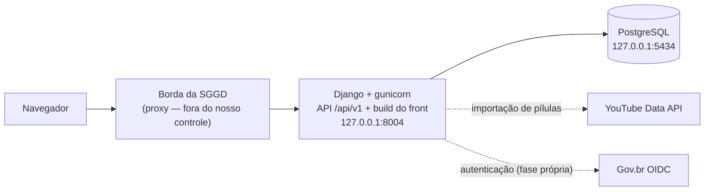

# Arquitetura-alvo da plataforma RECPSP

> O sistema como ele **deve ficar**, decidido em 27/08/2026. O par deste documento é
> o [`ARCHITECTURE.md`](../ARCHITECTURE.md), que descreve a base legada em
> demonstração. Decisões de fundo nos ADRs da frente ([`../adr/`](../adr/)) e nos
> transversais da vault.

| | |
|---|---|
| Versão | 1.0 |
| Data | 27/08/2026 |
| Base | ADRs 0001–0003 da frente · ADR-001/004/005/006/007/008 transversais · Documento de Requisitos v1.0 |
| Regra de manutenção | Este documento é o **alvo**. Divergência consciente na implementação atualiza este arquivo na mesma sessão. |
| Correções | 27/08/2026, etapa 0 — seção 9: a garantia de loopback do Vite é a publicação no host, não a ligação interna do processo ([ADR 0004](../adr/0004-loopback-em-conteiner.md)). |

---

## 1. O sistema em uma tela

Em produção e homologação há **um processo de aplicação**: o Django expõe a API e
serve os arquivos estáticos do front construído (via WhiteNoise). É a mesma
topologia do legado — um contêiner de aplicação, um de banco — o que mantém o
padrão de implantação do laboratório e simplifica a borda.

Em desenvolvimento são dois processos: o Vite serve o front em `127.0.0.1:5173`
com recarregamento automático e repassa `/api` para o Django em `8004`. Tudo em
contêiner (ADR-008); o Makefile é a porta de entrada.

## 2. Stack e por quê

| Camada | Escolha | Por quê |
|---|---|---|
| Linguagem do back | Python 3.12+ | Força do desenvolvedor; alinhamento com a BDLP; uma stack no laboratório (ADR 0002). |
| Framework | Django 5 (LTS vigente) | ORM, migrações versionadas, admin e autenticação prontos — três dívidas do legado viram propriedade da ferramenta (ADR 0001). |
| Camada de API | **Django Ninja** | Contrato OpenAPI gerado automaticamente (fecha a pendência do `openapi.yaml`); validação por Pydantic, coerente com type hints completos + mypy. Alternativa considerada: DRF — mais ecossistema, mais boilerplate, sem OpenAPI nativo decente. A troca, se necessária, é localizada: modelos, admin e migrações são Django puro. |
| Banco | PostgreSQL 16 | ADR 0001. |
| Front | React 19 + Vite + TypeScript | CRA foi descontinuado oficialmente em 14/02/2025; Vite é a recomendação do time do React. TypeScript paga-se na fronteira da API: os tipos são **gerados do OpenAPI** (`openapi-typescript`), então o contrato front↔back é verificado no build, não em produção. |
| Estado do servidor no front | TanStack Query 5 | Já era a escolha do legado — mas agora usada de verdade: toda escrita é `useMutation` com invalidação; nenhum `fetch` manual, nenhum `alert()`. |
| Design system | Tokens do ADR-007 + primitivos Radix UI | Comportamento de teclado, foco e ARIA por construção. Detalhe em [`design-system.md`](design-system.md). |
| Testes | pytest + pytest-django · Vitest + Testing Library · Playwright (fumaça + axe) | Ver seção 8. |
| Qualidade | ruff + mypy (back) · ESLint + tsc (front) · pre-commit | Padrões do desenvolvedor, agora com onde rodar (contêiner). |

## 3. Autenticação e sessão

**Sessão por cookie `HttpOnly` + proteção CSRF do Django.** Não se repete o JWT em
`localStorage` do legado: a auditoria de 26/08 demonstrou roubo de token por XSS
exatamente porque o token era legível por script. Cookie `HttpOnly`, `SameSite=Lax`
e `Secure` é imune a esse vetor e é o caminho de menor atrito com o Django.

- **Fase 1 (dev e homologação):** e-mail + senha, com o cadastro escalonado
  (representante cadastra, administração aprova — RF-AUT-02/03).
- **Fase 2 (exigência PRODESP para produção):** **Gov.br via OpenID Connect**
  (RF-AUT-01), como *provedor de identidade* plugado na mesma conta local — o
  Gov.br autentica, a conta da plataforma autoriza. A troca não muda o modelo de
  dados.
- O papel é sempre relido do banco a cada requisição — regra herdada do legado que
  os testes provaram valiosa (banimento e rebaixamento têm efeito imediato).

**Rede fechada por padrão.** O Documento de Requisitos delimita: "não é aberta ao
público; acesso restrito a agentes públicos" (RF-AUT-02). A base nova nasce com
leitura autenticada, atrás de uma configuração explícita (`LEITURA_PUBLICA`,
padrão desligado). O legado era público para leitura — a divergência está
registrada como pergunta 19 do `QUESTIONS.md`, a confirmar com a coordenação.

## 4. Aplicações Django

Uma aplicação por domínio. A fronteira é de dependência: `taxonomia` não conhece
ninguém; `forum` e `capacitacao` conhecem `taxonomia` e `contas`; nada conhece
`indicadores` (ela escuta sinais).

| App | Responsabilidade | Entidades principais |
|---|---|---|
| `contas` | identidade, órgãos e unidades, cadastro escalonado, especialidade, interesses, termos de uso | Usuario, Orgao, Unidade, CadastroPendente, Especialidade |
| `taxonomia` | os três eixos herdados da BDLP e o seed | CategoriaProcessual, Assunto, Natureza |
| `forum` | tópicos, respostas, reações, enquetes, tags, moderação, visualizações | Topico, Resposta, Reacao, OpcaoEnquete, VotoEnquete, Tag, EventoModeracao |
| `capacitacao` | catálogo de cursos, agrupamentos, eventos, pílulas, FAQ, registro de interesse | Curso, Instituicao, Agrupamento, Evento, Pilula, PerguntaFrequente, ProgressoCurso |
| `mensagens` | mensagens diretas e notificações | Mensagem, Notificacao |
| `portal` | home agregadora com cards geridos, páginas de regulamentação, termos de participação | CardHome, TermoParticipacao |
| `indicadores` | eventos de uso e as consultas do painel gerencial | EventoUso |

O detalhe campo a campo está em [`modelo-de-dados.md`](modelo-de-dados.md).

## 5. Moderação — a máquina de estados central

Todo tópico nasce `pendente` (ADR 0003). As regras de visibilidade são as que os
testes do legado provaram, agora **num único lugar** (um queryset gerenciado por
papel), não repetidas em quatro rotas:

| Quem | Vê nas listagens | Vê no detalhe |
|---|---|---|
| Usuário autenticado | aprovados + os próprios pendentes | idem; rejeitado só o próprio (com motivo) |
| Moderador / admin | tudo, exceto rejeitados nas listagens | tudo |
| Visitante (se `LEITURA_PUBLICA`) | só aprovados e não travados | idem |

A fila de curadoria é tela de primeira classe: contagem visível, ordenação por
tempo de espera, aprovação e rejeição com motivo, ação em lote. Toda decisão gera
`EventoModeracao` (auditoria) e notificação ao autor.

**Autorização é sempre do servidor.** O front esconde botão; quem nega é a API.
As 32 checagens espalhadas do legado viram permissões declarativas por rota.

## 6. Limpo para subcaminho (ADR-005, atualização 27/08)

Os quatro pontos, todos por variável de ambiente, nenhum chumbado:

| Ponto | Mecanismo |
|---|---|
| Base do build do front | `base` do Vite ← `RECPSP_BASE_PATH` |
| Prefixo do roteador | `basename` do React Router ← a mesma variável |
| Ativos (imagem, fonte, CSS) | resolvidos pelo Vite a partir da base; **fontes hospedadas localmente** (ADR-007) |
| Prefixo da API | cliente HTTP único lê `RECPSP_API_URL`; Django usa `FORCE_SCRIPT_NAME` quando montado sob subcaminho |

Critério de aceite: trocar o prefixo e reconstruir **sem tocar em código**. O
admin do Django fica sob caminho próprio, candidato ao subdomínio administrativo
do pedido à PRODESP (ADR-005).

## 7. Segurança por construção

- **CSP estrita desde o primeiro commit:** `script-src 'self'`, sem
  `unsafe-inline` e sem `unsafe-eval`; fontes e estilos servidos pela própria
  aplicação. O Vite gera arquivos — não há o chunk inline do CRA que exigiu
  contorno no legado.
- **Rate limit em toda a API** (django-ratelimit): limite global por sessão/IP e
  limites estreitos em autenticação, criação de conteúdo e mensagens. O legado só
  limitava o login.
- **Segredos por ambiente, sem fallback:** `SECRET_KEY`, credenciais do banco e
  chave do YouTube só por variável; ausência derruba o boot em produção
  (fail-loud), no padrão que o compose do legado já adota.
- **Conteúdo de usuário:** o editor continua Markdown; a renderização usa
  biblioteca com sanitização e allowlist de esquema de URL — a lição do XSS de
  `href` do legado, agora por construção e sob teste.
- **LGPD:** minimização (RNF-LGPD-01); CPF cifrado em repouso, exibido mascarado,
  fora de qualquer log; coleta só no fluxo do cadastrador (RNF-LGPD-02).
- **Exclusão de usuário anonimiza:** conteúdo público passa à conta sentinela;
  dado pessoal é apagado. Regra herdada da rodada de 26/08, que os testes já
  especificam — inclusive a reserva de identidade da sentinela.

## 8. Verificação

| Camada | Ferramenta | O que cobre |
|---|---|---|
| Regras de negócio da API | pytest + pytest-django | As regras dos 39 testes legados **traduzidas** (visibilidade, autorização, banimento, exclusão/anonimização, contrato de erro em JSON) + as novas (moderação total, especialidade, taxonomia, cadastro escalonado) |
| Componentes do front | Vitest + Testing Library | Design system (estados, teclado, rótulos) e páginas críticas |
| Fumaça + acessibilidade | Playwright + axe-core | Fluxos principais e o piso do ADR-007 (`make a11y-check`) |
| Estático | ruff, mypy, ESLint, tsc | pre-commit e CI |

CI: lint → testes de back → testes de front → build do front → build da imagem →
axe nas páginas construídas → auditoria de dependências. A imagem Docker passa a
ser construída no CI — lacuna apontada na auditoria do legado.

## 9. Convivência com o legado e corte

| Serviço | Porta (loopback) | Situação |
|---|---|---|
| Demonstração (base herdada) | 8003 | **Congelada.** Nenhuma funcionalidade nova; só correção de segurança crítica. |
| Aplicação nova (Django) | 8004 | Em construção. |
| PostgreSQL | 5434 | Da base nova. |
| Vite (só dev) | 5173 | Recarregamento automático; **loopback pela publicação no host** — em contêiner a ligação interna é `0.0.0.0` por necessidade do encaminhamento de porta ([ADR 0004](../adr/0004-loopback-em-conteiner.md)). |

Não há migração de dados (o banco herdado é descartável) nem roteador de
transição. O corte é único, quando a equipe validar a paridade: a nova assume o
lugar da demonstração, o código legado sai da árvore (permanece no histórico) e o
serviço externo `recpsp.onrender.com` é desativado (RNF-HOSP-03). O corte em
homologação é operação de servidor — esteira ou solicitação formal à TI (ADR-006).

## 10. O que esta arquitetura não decide

- Dono e escala da moderação diária — pergunta 17 do `QUESTIONS.md`.
- Nome de interface "trilha" × "agrupamento temático" — pergunta 8 (Lina).
- Leitura pública × rede fechada — pergunta 19 (a arquitetura suporta os dois).
- Data de lançamento, Resolução e governança da ferramenta — perguntas 1–3.
- Hospedagem de produção (PRODESP) e domínio — fora do alcance do repositório.
