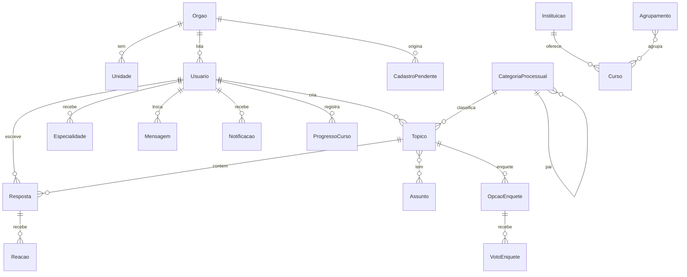

# Modelo de dados da base nova

> O schema como ele **deve nascer** no PostgreSQL, via modelos e migrações do
> Django. O par deste documento é o [`legado/modelo-de-dados.md`](../legado/modelo-de-dados.md),
> que descreve as 18 tabelas SQLite da base legada. Não há migração de dados: o
> banco herdado contém só demonstração e é descartado (ADR 0001).

| | |
|---|---|
| Versão | 1.0 |
| Data | 27/08/2026 |
| Base | ADR 0001 (banco) · ADR 0003 (papéis e taxonomia) · Documento de Requisitos, seções 5 e 9 |
| Convenções | nomes de modelo em português; `criado_em`/`atualizado_em` em todo modelo; FKs com política de exclusão explícita (seção 9) |

---

## 1. Visão geral

## 2. `contas`

### Usuario (modelo de usuário customizado; login por e-mail)

| Campo | Tipo | Observação |
|---|---|---|
| `email` | e-mail, único | campo de login |
| `nome` | texto | nome civil |
| `cpf` | texto **cifrado em repouso** | coletado só no cadastro escalonado; exibido mascarado; nunca em log (RNF-LGPD-02) |
| `orgao` | FK → Orgao, PROTECT | substitui o texto livre do legado (RF-AUT-06) |
| `unidade` | FK → Unidade, nulo, PROTECT | |
| `papel` | enum `usuario · moderador · administrador` | **três valores.** `especialista` não é papel (ADR 0003) |
| `cadastrador_de` | FK → Orgao, nulo | quem tem valor aqui é o representante que cadastra os servidores do próprio órgão (RF-AUT-03) — escopo por órgão, sem quarto papel |
| `banido` | booleano | bloqueia login e escrita, efeito imediato |
| `bio`, `localizacao` | texto | herdados do legado |
| `termos_aceitos_em` · `comunicado_aceito_em` | data-hora | RF-AUT-05 |
| `interesses` | M2M → Assunto | RF-AUT-07/RF-CAP-10; pop-up no primeiro uso, opcional |

**Conta sentinela:** usuária reservada que herda o conteúdo público de contas
excluídas. A exclusão de usuário **anonimiza** (conteúdo → sentinela; dado pessoal
apagado); a identidade da sentinela é reservada no cadastro e na edição de perfil.
Regras já especificadas pelos testes de 26/08 — valem na base nova.

### Orgao · Unidade

Orgao: `nome`, `sigla` (única), `ativo`. Unidade: `orgao` FK CASCADE, `nome`.
Existem para o campo virar seleção (RF-AUT-06) e para os indicadores por órgão
(RF-IND-01). A lista inicial vem dos ofícios de indicação da Fase 1.

### CadastroPendente

| Campo | Tipo |
|---|---|
| `orgao` | FK → Orgao, PROTECT |
| `nome` · `cpf` (cifrado) · `email` | texto |
| `criado_por` | FK → Usuario (o cadastrador), PROTECT |
| `status` | enum `pendente · aprovado · rejeitado` |
| `revisado_por` · `revisado_em` · `nota` | auditoria da decisão |

Aprovar cria a conta e dispara o convite. A interface do cadastrador é **página
própria**, não o admin (reunião de 11/08).

### Especialidade

| Campo | Tipo | Observação |
|---|---|---|
| `usuario` | FK → Usuario, CASCADE | |
| `macroetapa` | FK → CategoriaProcessual, nulo, PROTECT | só nível macroetapa |
| `assunto` | FK → Assunto, nulo, PROTECT | |
| `concedida_por` · `concedida_em` | auditoria | |

Restrição de banco: **exatamente um** entre `macroetapa` e `assunto` preenchido.
Única por (usuario, macroetapa) e (usuario, assunto). O selo exibe o termo
específico. `specialist_requests` do legado **não nasce** (ADR 0003).

## 3. `taxonomia` (semeada da BDLP v9 — fonte: `docker/postgres/init/07-categories.sql` e `06-taxonomia.sql` da BDLP)

- **CategoriaProcessual** — `nome`, `slug`, `pai` (FK para si, nulo), `nivel`
  (`macroetapa · subcategoria · microcategoria`), `ordem`. Seis macroetapas, na
  ordem da Lei 14.133/2021. Tópico se prende a **qualquer nível**; estatística
  agrega para cima.
- **Assunto** — `nome`, `slug`, `origem` (`bdlp · lina`). Os 14 da BDLP + os cinco
  termos pedidos pela Lina (ADR 0003; classificação a confirmar — pergunta 18).
- **Natureza** — os 5 valores da BDLP. É onde "Obras Públicas" vive
  (*Contratação de Obras e Serviços de Engenharia*).

Seed por comando de gestão idempotente (`seed_taxonomia`), espelhando o da BDLP.

## 4. `forum`

### Topico

| Campo | Tipo | Observação |
|---|---|---|
| `titulo` | texto ≤ 200 | |
| `conteudo` | texto (Markdown) ≤ 50.000 | **o corpo é campo do tópico.** Morre a gambiarra do legado ("o primeiro post é o corpo"), junto com o `reply_count = COUNT − 1` |
| `autor` | FK → Usuario, SET(sentinela) | |
| `tipo` | enum `discussao · pergunta · enquete` | |
| `status` | enum `pendente · aprovado · rejeitado`, **padrão `pendente`** | moderação total (ADR 0003) |
| `categoria` | FK → CategoriaProcessual, PROTECT | obrigatória |
| `assuntos` | M2M → Assunto | opcional |
| `natureza` | FK → Natureza, nulo, PROTECT | opcional |
| `tags` | M2M → Tag | vocabulário livre (RF-FOR-02) |
| `imagem` · `video_url` | arquivo/URL validada por allowlist de esquema | |
| `fixado` · `travado` | booleano | só moderação altera |
| `visualizacoes` | inteiro desnormalizado | deduplicação na tabela VisualizacaoTopico |

### Resposta

`topico` FK CASCADE · `autor` FK SET(sentinela) · `conteudo` (Markdown ≤ 50.000) ·
`melhor_resposta` (única por tópico) · `verificada` + `verificada_por` — a
"resposta verificada" atestada pela administração (RF-FOR-06) é da resposta, não
de quem escreve.

### Apoio

- **Reacao** — `resposta` FK CASCADE, `usuario` FK CASCADE, `tipo`
  (`curtida · descurtida`), única por (resposta, usuario). Funde as duas tabelas
  do legado cuja limpeza manual causou o defeito de exclusão.
- **CurtidaTopico** — única por (topico, usuario).
- **OpcaoEnquete** / **VotoEnquete** — voto único por (usuario, topico).
- **Tag** — `nome` único, criada sob demanda.
- **EventoModeracao** — `topico`, `acao` (`aprovado · rejeitado · travado ·
  destravado · fixado`), `por`, `nota`, `em`. Auditoria da curadoria.
- **VisualizacaoTopico** — `topico`, `chave` (usuário ou hash de IP), `visto_em`;
  janela de 30 min por chave. Substitui o `Map` em memória do legado, que se
  perdia a cada reinício e não funcionava com duas instâncias.

## 5. `capacitacao` — uma fonte de verdade

Encerra o achado mais confuso do legado: catálogo em três lugares que não
coincidiam (dado estático no front, seed no servidor e lista fixa de validação).
**Tudo vira tabela gerida pela administração** (RF-CAP-02).

| Modelo | Campos principais | Observação |
|---|---|---|
| Instituicao | `nome`, `tipo` (`escola_de_governo · universidade · orgao`), `url` | ENAP, EGESP, TCE, UNICAMP… |
| Curso | `titulo`, `descricao`, `url` **própria**, `instituicao` FK, `modalidade`, `situacao` (`inscricao_aberta · em_andamento · realizado`), `carga_horaria`, `nivel`, `assuntos` M2M, `macroetapa` FK nula, `ativo` | RF-CAP-02; a situação cobre os três estados pedidos |
| Agrupamento | `nome`, `descricao`, `ordem` + M2M ordenada com Curso | o "agrupamento temático" — nome de interface em aberto (pergunta 8) |
| Evento | `titulo`, `inicio`, `fim`, `formato`, `url_acesso`, `url_gravacao`, `instituicao` FK | RF-CAP-07; **mata as datas fixas em código** que esvaziariam o calendário em 30/10/2026 |
| Pilula | `titulo`, `url`, `playlist_id`, `instituicao` FK, `assuntos` M2M | importação YouTube (RF-CAP-06) — **só após a rotação da chave** |
| PerguntaFrequente | `pergunta`, `resposta`, `ordem`, `ativo` | RF-CAP-08, com busca; edição pela administração |
| ProgressoCurso | `usuario` FK CASCADE, `curso` FK CASCADE, `acessado_em` | registra **o clique** — sem barra de progresso (decisão de 27/07) |

## 6. `mensagens`

- **Mensagem** — `de`/`para` FK SET(sentinela), `conteudo`, `lida_em`.
- **Notificacao** — `usuario` FK CASCADE, `tipo` (`mensagem · moderacao ·
  especialidade`), `titulo`, `url_destino`, `lida_em`. O legado tinha 4 tipos e o
  front só tratava 1; aqui **toda notificação carrega o destino** — o clique
  sempre navega.

## 7. `portal` e `indicadores`

- **CardHome** — `titulo`, `descricao`, `url`, `icone`, `ordem`, `ativo`. A home
  agregadora gerida pela administração (RF-HOM-01/02), incluindo o card do Hub.
- **TermoParticipacao** — `orgao` FK, `arquivo`, `publicado_em`. **Condicionado à
  publicação da Resolução** (RF-GOV-01, prioridade M*); o modelo espera, a tela
  só nasce com a norma.
- **EventoUso** — `usuario` FK nula SET_NULL, `tipo` (`login · visualizacao ·
  acesso_curso · criacao_topico · resposta · busca`), `referencia`, `em`.
  Alimenta o RF-IND-01 (cadastros por órgão, logins, interesses, engajamento).
  Painel é consulta agregada, não tabela.

## 8. Índices (desde a migração inicial — ADR 0001)

- `Topico(status, criado_em)` — listagens e fila de moderação.
- `Topico(categoria)` · `Resposta(topico)` · `Reacao(resposta)`.
- `Mensagem(para, lida_em)` · `Notificacao(usuario, lida_em)`.
- `EventoUso(tipo, em)` · `Usuario(orgao)` · `CadastroPendente(status)`.
- Busca: `GIN` com `unaccent` + `tsvector` em `Topico(titulo, conteudo)`, `Curso(titulo, descricao)` e `PerguntaFrequente` — o `normalize_text` artesanal do legado vira recurso nativo do PostgreSQL (RF-BUS-01).

## 9. Política de exclusão (chaves estrangeiras)

| Relação | Política | Racional |
|---|---|---|
| conteúdo → autor | `SET(sentinela)` | exclusão de pessoa anonimiza, não destrói o fórum |
| filho de composição (Resposta→Topico, Reacao→Resposta, Opcao/Voto→enquete, Unidade→Orgao) | `CASCADE` | apagar o pai apaga o que só existe por causa dele — a classe de defeito da limpeza manual do legado deixa de existir |
| referência de classificação (→ CategoriaProcessual, Assunto, Natureza, Orgao, Instituicao) | `PROTECT` | taxonomia e cadastro não somem com conteúdo pendurado |

## 10. O que foi reaproveitado do legado — e o que morreu

**Reaproveitado (como regra, não como código):** mecânica de tópicos/respostas/
curtidas/enquetes; papel relido a cada requisição; visibilidade por papel;
anonimização com conta sentinela; limites de campo; aceite de termos + comunicado.

**Morreu:** `specialist_requests` (nunca usada); `role='especialista'` (vira
Especialidade); órgão texto-livre (vira FK); "primeiro post é o corpo";
`post_likes`/`post_dislikes` separadas (viram Reacao); catálogo em três lugares
(vira `capacitacao`); eventos com data fixa em código; `viewedTopics` em memória;
seed com credencial em código (dev usa fixture opt-in; produção cria admin por
variável ou sorteio, padrão herdado da rodada de 26/08).
